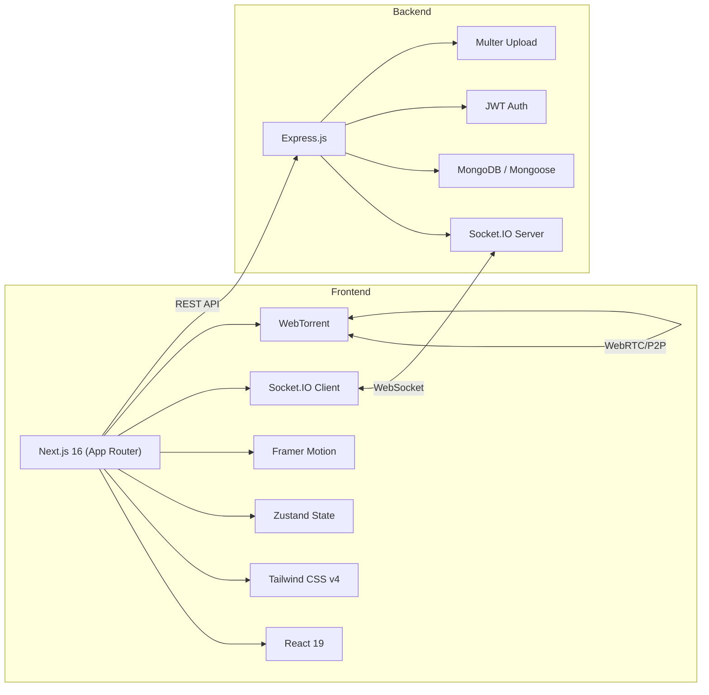
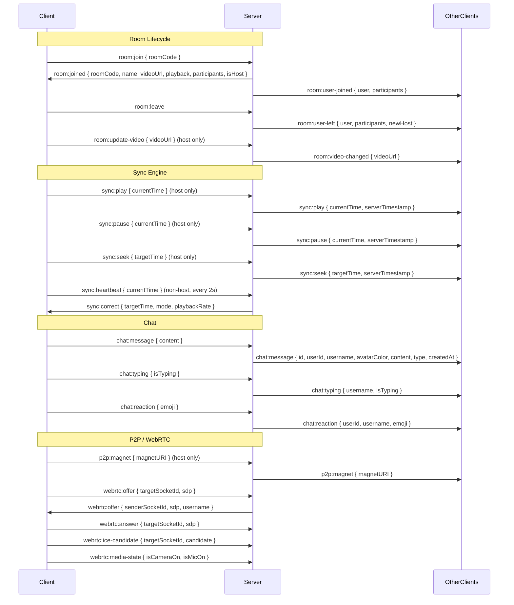

# NOCTA — Full Project Audit

> **Prepared:** 6 July 2026  
> **Branch:** `main` (1 commit — `af60b5b` "Initial commit: NOCTA Monorepo", 13 May 2026)  
> **Uncommitted changes:** 5 files in `backend/` (Prisma added, JSDoc comments stripped)

---

## 1. Project Overview

NOCTA is a **private watch-party platform** designed for couples and small friend groups (2–6 people). Users create or join a room, the host selects a video (YouTube link, Instagram reel, or local file), and all participants' playback is kept in sync in real time. The app also provides live chat, emoji reactions, and P2P video streaming via WebTorrent.

### Core Value Proposition
- "Watch together. Stay connected."  
- Intimate, small-group rooms (max 6 participants)  
- Rooms auto-expire after 24 hours  
- Calming, dark-mode-first "low cortisol" UI design

---

## 2. Architecture & Tech Stack



| Layer | Technology | Version |
|-------|-----------|---------|
| **Frontend Framework** | Next.js (App Router) | 16.2.6 |
| **React** | React + ReactDOM | 19.2.4 |
| **Styling** | Tailwind CSS | v4 |
| **Animations** | Framer Motion | 12.38.0 |
| **State Management** | Zustand | 5.0.13 |
| **Real-time** | Socket.IO Client | 4.8.3 |
| **P2P Streaming** | WebTorrent | 2.8.5 |
| **Backend Runtime** | Node.js + Express | 4.21.2 |
| **Real-time Server** | Socket.IO | 4.8.1 |
| **Database** | MongoDB (Mongoose) | 8.9.5 |
| **Auth** | JWT (jsonwebtoken) | 9.0.2 |
| **Password Hashing** | bcryptjs | 3.0.3 |
| **File Upload** | Multer | 2.1.1 |
| **Rate Limiting** | express-rate-limit | 7.5.0 |
| **ID Generation** | nanoid | 3.3.8 |
| **Dev Server** | nodemon | 3.1.9 |

> [!WARNING]
> **Prisma was installed** (`@prisma/client` + `prisma` in `package.json`, `DATABASE_URL` in `.env`) but is **not used anywhere in the codebase**. This is dead weight and should be removed or implemented.

---

## 3. Complete File Inventory

### 3.1 Backend — `d:\NOCTA\backend\`

| File | Size | Purpose |
|------|------|---------|
| [server.js](file:///d:/NOCTA/backend/src/server.js) | 4.0 KB | Express app entrypoint, HTTP server, Multer upload, graceful shutdown |
| [config/db.js](file:///d:/NOCTA/backend/src/config/db.js) | 1.1 KB | MongoDB connection with reconnect handling |
| [middleware/auth.js](file:///d:/NOCTA/backend/src/middleware/auth.js) | 1.1 KB | JWT verification for both Express routes and Socket.IO handshakes |
| [middleware/rateLimiter.js](file:///d:/NOCTA/backend/src/middleware/rateLimiter.js) | 1.1 KB | Express rate limiter (100 req/min API, 20/15min auth) + socket event limiter |
| [models/User.js](file:///d:/NOCTA/backend/src/models/User.js) | 1.4 KB | Mongoose User schema with bcrypt password hashing |
| [models/Room.js](file:///d:/NOCTA/backend/src/models/Room.js) | 870 B | Mongoose Room schema with 24h TTL auto-expiry |
| [models/Message.js](file:///d:/NOCTA/backend/src/models/Message.js) | 749 B | Mongoose Message schema for chat persistence |
| [routes/auth.js](file:///d:/NOCTA/backend/src/routes/auth.js) | 6.1 KB | Register, Login, Guest, Google, /me endpoints |
| [routes/rooms.js](file:///d:/NOCTA/backend/src/routes/rooms.js) | 2.7 KB | Create room, get room info, get messages |
| [routes/health.js](file:///d:/NOCTA/backend/src/routes/health.js) | 302 B | Health check endpoint with live room stats |
| [socket/index.js](file:///d:/NOCTA/backend/src/socket/index.js) | 2.3 KB | Socket.IO init, auth middleware, handler registration |
| [socket/roomHandler.js](file:///d:/NOCTA/backend/src/socket/roomHandler.js) | 3.9 KB | Join/leave room, host video update, disconnect handling |
| [socket/chatHandler.js](file:///d:/NOCTA/backend/src/socket/chatHandler.js) | 2.4 KB | Chat messages (persisted), typing indicators, emoji reactions |
| [socket/syncHandler.js](file:///d:/NOCTA/backend/src/socket/syncHandler.js) | 3.7 KB | Play/pause/seek sync, heartbeat drift correction, P2P magnet relay |
| [socket/signalingHandler.js](file:///d:/NOCTA/backend/src/socket/signalingHandler.js) | 1.8 KB | WebRTC SDP offer/answer, ICE candidates, media state relay |
| [socket/roomState.js](file:///d:/NOCTA/backend/src/socket/roomState.js) | 4.9 KB | In-memory room state manager (singleton) — participants, playback, typing, peers |

### 3.2 Frontend — `d:\NOCTA\frontend\`

| File | Size | Purpose |
|------|------|---------|
| [app/layout.tsx](file:///d:/NOCTA/frontend/src/app/layout.tsx) | 963 B | Root layout with metadata, Google Fonts, dark class |
| [app/providers.tsx](file:///d:/NOCTA/frontend/src/app/providers.tsx) | 930 B | Client-side providers — SocketProvider, Toast, ReactionOverlay, session hydration |
| [app/page.tsx](file:///d:/NOCTA/frontend/src/app/page.tsx) | 432 B | Landing page — Navbar + Hero + CreateJoinRoom |
| [app/globals.css](file:///d:/NOCTA/frontend/src/app/globals.css) | 2.7 KB | NOCTA design system tokens, ambient glows, scrollbar, gradient text |
| [app/room/[id]/page.tsx](file:///d:/NOCTA/frontend/src/app/room/%5Bid%5D/page.tsx) | 3.3 KB | Room page — session recovery, auth gate, video + chat layout |
| [lib/utils.ts](file:///d:/NOCTA/frontend/src/lib/utils.ts) | 3.9 KB | API helper, YouTube/Instagram URL parsing, video codec validation |
| [lib/socket.ts](file:///d:/NOCTA/frontend/src/lib/socket.ts) | 1.2 KB | Socket.IO singleton factory with token-based teardown |
| [hooks/useSocket.ts](file:///d:/NOCTA/frontend/src/hooks/useSocket.ts) | 4.6 KB | Room/chat/typing/reaction socket event handlers and emitters |
| [context/SocketProvider.tsx](file:///d:/NOCTA/frontend/src/context/SocketProvider.tsx) | 3.6 KB | Socket lifecycle manager — connect/disconnect/reconnect/error handling |
| [stores/roomStore.ts](file:///d:/NOCTA/frontend/src/stores/roomStore.ts) | 6.6 KB | Zustand store with 6 slices (Identity, Room, Sync, P2P, Diagnostics, UI) |
| [components/landing/Hero.tsx](file:///d:/NOCTA/frontend/src/components/landing/Hero.tsx) | 614 B | Animated headline |
| [components/landing/CreateJoinRoom.tsx](file:///d:/NOCTA/frontend/src/components/landing/CreateJoinRoom.tsx) | 19.8 KB | Full auth modal (Guest / Email Login / Register / Google) + Create & Join room |
| [components/layout/Navbar.tsx](file:///d:/NOCTA/frontend/src/components/layout/Navbar.tsx) | 2.7 KB | Fixed nav with logo, user avatar, sign-out |
| [components/room/VideoPlayer.tsx](file:///d:/NOCTA/frontend/src/components/room/VideoPlayer.tsx) | 18.1 KB | YouTube IFrame API, HTML5 `<video>`, file upload, sync events, heartbeat |
| [components/room/TorrentPlayer.tsx](file:///d:/NOCTA/frontend/src/components/room/TorrentPlayer.tsx) | 4.4 KB | WebTorrent seed/leech lifecycle, video element binding |
| [components/room/ChatSidebar.tsx](file:///d:/NOCTA/frontend/src/components/room/ChatSidebar.tsx) | 5.7 KB | Chat messages list, typing indicator, message input |
| [components/room/RoomControls.tsx](file:///d:/NOCTA/frontend/src/components/room/RoomControls.tsx) | 5.2 KB | Room name, invite link copy, reactions, chat toggle, leave |
| [components/room/ParticipantList.tsx](file:///d:/NOCTA/frontend/src/components/room/ParticipantList.tsx) | 1.3 KB | Avatar stack with tooltip showing host badge |
| [components/room/ReactionOverlay.tsx](file:///d:/NOCTA/frontend/src/components/room/ReactionOverlay.tsx) | 1.5 KB | Floating emoji animation overlay |
| [components/room/DiagnosticsOverlay.tsx](file:///d:/NOCTA/frontend/src/components/room/DiagnosticsOverlay.tsx) | 2.1 KB | P2P stats panel (peers, speed, buffer health) |
| [components/ui/Avatar.tsx](file:///d:/NOCTA/frontend/src/components/ui/Avatar.tsx) | 1.3 KB | Color-coded initials avatar |
| [components/ui/Button.tsx](file:///d:/NOCTA/frontend/src/components/ui/Button.tsx) | 2.1 KB | Variant button (primary, secondary, google, danger) |
| [components/ui/Input.tsx](file:///d:/NOCTA/frontend/src/components/ui/Input.tsx) | 996 B | Styled input with error display |
| [components/ui/Modal.tsx](file:///d:/NOCTA/frontend/src/components/ui/Modal.tsx) | 1.9 KB | AnimatePresence modal with backdrop |
| [components/ui/Toast.tsx](file:///d:/NOCTA/frontend/src/components/ui/Toast.tsx) | 1.3 KB | Toast notification system |

---

## 4. Data Models

### 4.1 User (`models/User.js`)
```
┌──────────────────────────────────────────────┐
│ User                                         │
├──────────────────────────────────────────────┤
│ username    : String (unique, 2–20 chars)    │
│ email       : String (unique, sparse, gmail) │
│ password    : String (bcrypt, select: false)  │
│ googleId    : String (sparse)                │
│ avatarColor : String (random from palette)   │
│ isGuest     : Boolean (default: true)        │
│ lastSeen    : Date                           │
│ timestamps  : createdAt, updatedAt           │
└──────────────────────────────────────────────┘
Pre-save hook: bcrypt hash (10 rounds)
Method: comparePassword(candidatePassword)
```

### 4.2 Room (`models/Room.js`)
```
┌──────────────────────────────────────────────┐
│ Room                                         │
├──────────────────────────────────────────────┤
│ roomCode        : String (unique, uppercase) │
│ name            : String (1–50 chars)        │
│ hostId          : ObjectId → User            │
│ videoUrl        : String (default: '')       │
│ maxParticipants : Number (2–6, default: 6)   │
│ isPrivate       : Boolean (default: true)    │
│ isActive        : Boolean (default: true)    │
│ expiresAt       : Date (24h TTL index)       │
│ timestamps      : createdAt, updatedAt       │
└──────────────────────────────────────────────┘
TTL Index: expiresAt (auto-delete expired rooms)
```

### 4.3 Message (`models/Message.js`)
```
┌──────────────────────────────────────────────┐
│ Message                                      │
├──────────────────────────────────────────────┤
│ roomId      : ObjectId → Room                │
│ userId      : ObjectId → User                │
│ username    : String                         │
│ avatarColor : String                         │
│ content     : String (max 500 chars)         │
│ type        : 'message' | 'reaction' | 'system' │
│ emoji       : String (optional)              │
│ timestamps  : createdAt, updatedAt           │
└──────────────────────────────────────────────┘
Index: { roomId, createdAt: -1 }
```

### 4.4 In-Memory Room State (`socket/roomState.js`)
```
activeRooms = Map<roomCode, {
  participants : Map<socketId, { userId, username, avatarColor, joinedAt, isHost }>
  playback     : { isPlaying, currentTime, lastUpdated, playbackRate, videoUrl }
  p2p          : { magnetURI }
  typing       : Set<username>
  peers        : Map<socketId, { userId, username }>
}>
```

> [!IMPORTANT]
> All transient state (who's in the room, playback position, typing indicators) lives **only in memory**. A server restart loses all active sessions. MongoDB stores persistent data only (users, rooms, messages).

---

## 5. Authentication System — Full Audit

### 5.1 Auth Flows Supported

| Flow | Endpoint | Status | Notes |
|------|----------|--------|-------|
| **Email Registration** | `POST /api/auth/register` | ✅ Working | Gmail-only, password validation (8+ chars, number, special char) |
| **Email Login** | `POST /api/auth/login` | ✅ Working | bcrypt comparison, returns JWT |
| **Guest Access** | `POST /api/auth/guest` | ✅ Working | Username only, creates a DB record with `isGuest: true` |
| **Google Sign-In** | `POST /api/auth/google` | ⚠️ **MOCK ONLY** | Frontend sends fake hardcoded data — no real Google OAuth |
| **Session Recovery** | `GET /api/auth/me` | ✅ Working | Verifies JWT, returns user profile |

### 5.2 JWT Token Details
- **Algorithm:** HS256 (default `jsonwebtoken`)
- **Expiry:** 7 days
- **Payload:** `{ userId, username, avatarColor }`
- **Secret:** `nocta-dev-secret-change-in-production` (from `.env`)
- **Storage:** `localStorage` (frontend)

### 5.3 Auth Security Analysis

| Check | Status | Details |
|-------|--------|---------|
| Password hashing | ✅ | bcrypt, 10 salt rounds |
| Rate limiting (auth routes) | ✅ | 20 requests / 15 minutes per IP |
| Rate limiting (API routes) | ✅ | 100 requests / 1 minute per IP |
| Token validation (REST) | ✅ | JWT verified on all `/api/rooms` routes |
| Token validation (WebSocket) | ✅ | JWT verified during Socket.IO handshake |
| Input validation | ✅ | Username length, email domain, password regex |
| Case-insensitive username check | ✅ | Regex with `$regex` + `'i'` flag |

> [!CAUTION]
> **Critical Security Issues Found:**
> 
> 1. **JWT Secret is hardcoded in `.env`** — `nocta-dev-secret-change-in-production`. This MUST be changed before any deployment.
> 2. **Google Sign-In is completely faked** — The frontend sends mock data (`handleGoogleSignIn` at [CreateJoinRoom.tsx:143-170](file:///d:/NOCTA/frontend/src/components/landing/CreateJoinRoom.tsx#L143-L170)). The backend accepts it without verification. Anyone can impersonate any Google user.
> 3. **No RBAC / Admin Role** — The User model has no `role` field. There is no concept of admin, moderator, or any privilege level.
> 4. **Tokens stored in localStorage** — Vulnerable to XSS. Consider `httpOnly` cookies.
> 5. **No email verification** — Users can register with any `@gmail.com` address without proving ownership.
> 6. **No password reset flow** — Users cannot recover their accounts.
> 7. **RegEx injection risk** — Username search uses `new RegExp(username, 'i')` without escaping special regex characters. A username like `.*` could match all users. Found in [auth.js:49](file:///d:/NOCTA/backend/src/routes/auth.js#L49), [auth.js:131](file:///d:/NOCTA/backend/src/routes/auth.js#L131), [auth.js:174](file:///d:/NOCTA/backend/src/routes/auth.js#L174).

---

## 6. Real-Time System (Socket.IO)

### 6.1 Event Map



### 6.2 Sync Drift Correction

The server uses a **three-tier correction strategy** for non-host clients ([syncHandler.js:72-103](file:///d:/NOCTA/backend/src/socket/syncHandler.js#L72-L103)):

| Drift | Action | Method |
|-------|--------|--------|
| < 0.5s | Ignored | Natural network variance |
| 0.5–2.0s | Rate adjust | Temporarily set playback to 1.05× or 0.95× for 3 seconds |
| > 2.0s | Hard seek | Jump directly to expected position |

### 6.3 Connection Resilience

- **WebSocket preferred**, polling fallback
- **Reconnection:** 5 attempts, 2s initial delay, 10s max delay
- **Connection State Recovery:** 2-minute window for seamless reconnect
- **Visibility Change Recovery:** When tab becomes visible, requests sync state from server
- **Heartbeat:** Non-host clients report position every 2 seconds

---

## 7. Video Playback System

### 7.1 Supported Sources

| Source | Detection | Player | Sync Support |
|--------|-----------|--------|:-----:|
| **YouTube** | URL pattern match → IFrame API | `window.YT.Player` | ✅ |
| **Instagram Reels** | URL pattern match | `<iframe>` embed | ❌ (no sync control) |
| **Local File Upload** | File input + codec validation | `<video>` + WebTorrent | ✅ |
| **Backend Upload** | `/uploads/` path detection | `<video>` tag | ✅ |

### 7.2 P2P Streaming (WebTorrent)

- **Host seeds** local file via WebTorrent → generates magnet URI
- **Magnet URI relayed** to all room participants via Socket.IO
- **Peers leech** the torrent and stream directly to `<video>` element
- **STUN server:** `stun:stun.l.google.com:19302`
- **Diagnostics overlay** shows real-time P2P stats (peers, speed, buffer health)

> [!NOTE]
> P2P streaming only works for **local file uploads**. YouTube and Instagram use their own CDNs. The WebRTC signaling handlers exist for future video call support but are **not connected to any UI** currently.

---

## 8. Frontend State Management

The Zustand store is organized into **6 slices** ([roomStore.ts](file:///d:/NOCTA/frontend/src/stores/roomStore.ts)):

| Slice | Responsibility | Key State |
|-------|---------------|-----------|
| **Identity** | Auth state, localStorage persistence | `user`, `token` |
| **Room** | Room membership, participants | `roomCode`, `roomName`, `isHost`, `participants` |
| **Sync** | Video playback state | `playback { isPlaying, currentTime, playbackRate, videoUrl }` |
| **P2P** | WebTorrent connection state | `magnetURI`, `status`, `downloadSpeed`, `peers`, `bufferHealth` |
| **UI** | Chat, modals, toasts, fullscreen | `messages`, `typingUsers`, `isChatOpen`, `authModalOpen`, `toasts` |
| **Diagnostics** | Debug overlay toggle | `showDiagnostics` |

---

## 9. UI/UX Design System

### 9.1 Design Philosophy
- **"Low Cortisol"** — Calming, warm, intimate
- Dark-mode-first with very subtle warm ambient glows
- Inter font family
- Lavender-to-sage gradient accents

### 9.2 Color Palette

| Token | Value | Usage |
|-------|-------|-------|
| `nocta-bg` | `#0A0A0C` | Primary background |
| `nocta-bg-secondary` | `#101014` | Secondary surfaces |
| `nocta-surface` | `rgba(255,255,255,0.025)` | Cards, inputs |
| `nocta-text` | `#E8E4DF` | Primary text (warm white) |
| `nocta-text-secondary` | `#9A958F` | Secondary text |
| `nocta-text-muted` | `#5A564F` | Muted/disabled text |
| `nocta-accent` | `#A89EC8` | Primary accent (lavender) |
| `nocta-success` | `#89B0AE` | Success state (sage green) |
| `nocta-danger` | `#C88B8B` | Error/danger state (muted rose) |

### 9.3 UI Components Library

| Component | Features |
|-----------|----------|
| `Avatar` | Color-coded initials, online indicator, sm/md/lg sizes |
| `Button` | 4 variants (primary, secondary, google, danger), loading spinner, size options |
| `Input` | Styled input with error message display |
| `Modal` | Framer Motion animated modal with backdrop click to close |
| `Toast` | Auto-dismissing (4s) notification system with info/success/error/warning types |

---

## 10. API Endpoints Summary

### REST API (`http://localhost:3001`)

| Method | Path | Auth | Purpose |
|--------|------|:----:|---------|
| `POST` | `/api/auth/register` | ❌ | Create account (Gmail + password) |
| `POST` | `/api/auth/login` | ❌ | Login with email + password |
| `POST` | `/api/auth/guest` | ❌ | Create guest session |
| `POST` | `/api/auth/google` | ❌ | Google sign-in (mock) |
| `GET` | `/api/auth/me` | ✅ | Verify token, get user data |
| `POST` | `/api/rooms` | ✅ | Create a new room |
| `GET` | `/api/rooms/:code` | ✅ | Get room info + participant count |
| `GET` | `/api/rooms/:code/messages` | ✅ | Get paginated chat messages |
| `POST` | `/api/upload` | ❌ | Upload video file (500MB limit) |
| `GET` | `/api/health` | ❌ | Server health + active room stats |

> [!WARNING]
> **The upload endpoint (`POST /api/upload`) has NO authentication middleware!** Anyone can upload 500MB files to the server without being logged in. This is a significant vulnerability.

---

## 11. What's Working ✅

| Feature | Status | Notes |
|---------|:------:|-------|
| User registration (email/password) | ✅ | Gmail-only, password rules enforced |
| User login | ✅ | bcrypt comparison, JWT returned |
| Guest access | ✅ | Username-only, creates DB record |
| Session persistence | ✅ | localStorage token + user, auto-recovery on page load |
| Create room | ✅ | 6-char nanoid code, stored in MongoDB |
| Join room by code | ✅ | Validates room exists and is active |
| Room capacity enforcement | ✅ | Max 6 participants checked on join |
| Real-time participant updates | ✅ | Join/leave broadcasts to all |
| Host transfer on disconnect | ✅ | First remaining participant becomes host |
| YouTube sync playback | ✅ | IFrame API, play/pause/seek sync |
| Local file playback | ✅ | HTML5 `<video>` with codec validation |
| Heartbeat drift correction | ✅ | 3-tier correction (ignore / rate / seek) |
| Live chat | ✅ | Persisted in MongoDB, max 500 chars |
| Typing indicators | ✅ | Real-time with 3s auto-clear |
| Emoji reactions | ✅ | Floating animation overlay |
| P2P file streaming | ✅ | WebTorrent seed/leech |
| P2P diagnostics overlay | ✅ | Dev-mode stats panel |
| Room invite link copy | ✅ | Copies shareable URL to clipboard |
| Room 24h auto-expiry | ✅ | MongoDB TTL index |
| Rate limiting | ✅ | API + Auth + Socket events |
| Responsive design | ✅ | Mobile-friendly layout |
| Toast notifications | ✅ | Auto-dismiss, 4 severity levels |
| SEO metadata | ✅ | OpenGraph tags on landing page |

---

## 12. What's NOT Working / Missing ❌

### 12.1 Critical Gaps

| Feature | Status | Impact |
|---------|:------:|--------|
| **Admin Portal** | ❌ Missing | No way to monitor users, rooms, or moderate content |
| **Google OAuth (real)** | ❌ Mocked | Frontend sends fake data; no `googleapis` integration |
| **Email verification** | ❌ Missing | Unverified email registration |
| **Password reset** | ❌ Missing | Users cannot recover accounts |
| **Upload auth** | ❌ Missing | Anyone can upload 500MB files without authentication |
| **Admin role / RBAC** | ❌ Missing | User model has no `role` field |

### 12.2 Functional Gaps

| Feature | Status | Notes |
|---------|:------:|-------|
| Video call (WebRTC) | ⚠️ Partial | Signaling handlers exist, but **no UI** for camera/mic |
| Instagram sync | ❌ | Embeds in iframe but **cannot control playback** |
| Room discovery / listing | ❌ | No browse/search rooms feature |
| Room passwords | ❌ | Rooms are accessible by anyone with the code |
| Kick/ban user | ❌ | Host cannot remove participants |
| User profile editing | ❌ | Cannot change username, avatar, or password |
| Persistent playback history | ❌ | No watch history |
| Mobile app | ❌ | Web-only |
| Deployment config | ❌ | No Docker, no CI/CD, no production configs |
| Automated tests | ❌ | Zero test files anywhere |
| Error boundary | ❌ | No React error boundaries |
| HTTPS / WSS | ❌ | All connections are `http://` / `ws://` |

### 12.3 Code Quality Issues

| Issue | Location | Severity |
|-------|----------|:--------:|
| Prisma installed but unused | [package.json](file:///d:/NOCTA/backend/package.json#L11) | Low |
| `backend/src/lib/` directory is empty | Backend lib folder | Low |
| Duplicate `identitySlice.ts` exists in stores/slices/ alongside inline slices in roomStore.ts | [stores/slices/](file:///d:/NOCTA/frontend/src/stores/slices) | Low |
| JSDoc comments stripped in uncommitted changes | `auth.js`, `rooms.js` | Low |
| `handleGoogleSignIn` has artificial 1.2s delay to "feel real" | [CreateJoinRoom.tsx:148-149](file:///d:/NOCTA/frontend/src/components/landing/CreateJoinRoom.tsx#L148-L149) | Medium |
| No TypeScript strict mode | [tsconfig.json](file:///d:/NOCTA/frontend/tsconfig.json) | Low |

---

## 13. Admin Portal — Current Status & Requirements

> [!CAUTION]
> **There is NO admin portal, admin route, admin model, or admin role in the entire codebase.** Building one requires changes across both backend and frontend.

### What Would Be Needed

#### Backend Changes
1. Add `role` field to User model (`'user' | 'admin'`)
2. Create admin auth middleware (check `role === 'admin'`)
3. New admin API routes:
   - `GET /api/admin/users` — list/search all users
   - `GET /api/admin/rooms` — list all active rooms with participants
   - `GET /api/admin/stats` — dashboard metrics (total users, rooms, messages)
   - `DELETE /api/admin/users/:id` — ban/delete user
   - `DELETE /api/admin/rooms/:code` — force-close room
   - `GET /api/admin/messages` — search/moderate messages
4. Seed script to create initial admin user

#### Frontend Changes
1. New `/admin` route with admin login
2. Dashboard page with live metrics
3. Users management table
4. Active rooms monitoring
5. Message moderation panel
6. Protected by admin-only auth gate

---

## 14. Environment & Running Status

| Service | Status | Port |
|---------|:------:|:----:|
| MongoDB Server | 🟢 Running | 27017 |
| Backend (Express) | 🔴 Stopped | 3001 |
| Frontend (Next.js) | 🔴 Stopped | 3000 |

### How to Start
```bash
# Terminal 1 — Backend
cd d:\NOCTA\backend
npm run dev     # nodemon on port 3001

# Terminal 2 — Frontend
cd d:\NOCTA\frontend
npm run dev     # next dev on port 3000
```

---

## 15. Recommendations for Review

### Priority 1 — Must Fix Before Any Deployment
1. 🔴 Change JWT secret from hardcoded dev value
2. 🔴 Add authentication to `/api/upload` endpoint
3. 🔴 Escape regex characters in username lookups (prevent ReDoS / injection)
4. 🔴 Implement real Google OAuth or remove the feature
5. 🔴 Add admin role and admin portal

### Priority 2 — Should Fix Soon
6. 🟡 Add email verification flow
7. 🟡 Add password reset flow
8. 🟡 Remove unused Prisma dependency
9. 🟡 Add React error boundaries
10. 🟡 Add CORS restrictions beyond `CLIENT_URL`

### Priority 3 — Nice to Have
11. 🟢 Add automated tests (at minimum, auth flow tests)
12. 🟢 Add Docker Compose for local dev
13. 🟢 Add CI/CD pipeline
14. 🟢 Complete WebRTC video call UI
15. 🟢 Add room password protection
16. 🟢 Host kick/ban functionality

---

> **Summary:** NOCTA has a solid foundation with a well-architected real-time sync engine, clean component structure, and a polished UI design system. However, it is currently a **dev-stage prototype** with significant security gaps (mock Google auth, unprotected uploads, hardcoded secrets) and no admin tooling. The authentication system works correctly for email/guest flows but needs hardening before production. An admin portal does not exist and needs to be built from scratch.
